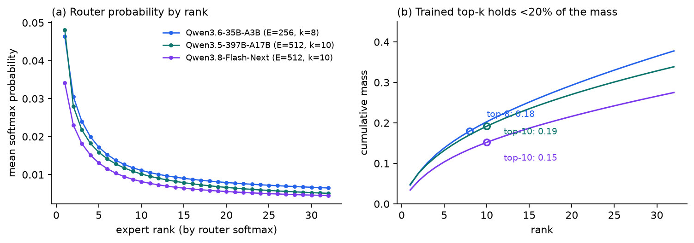
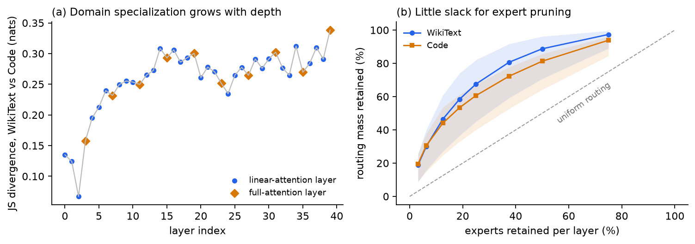
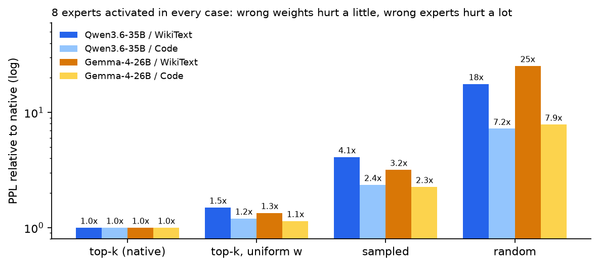
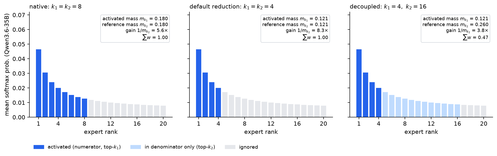
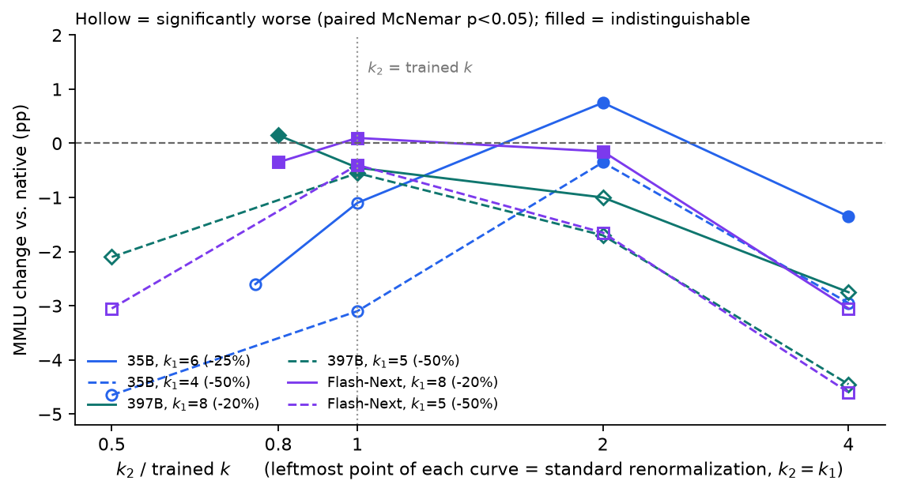
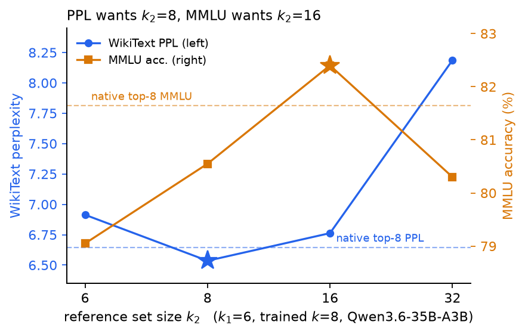
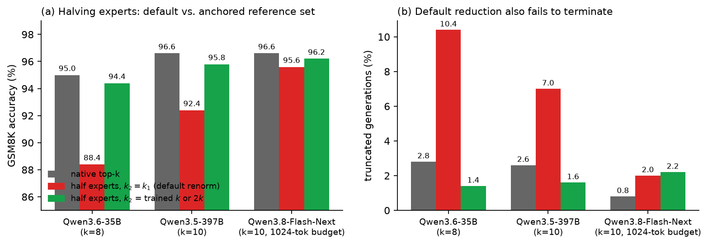
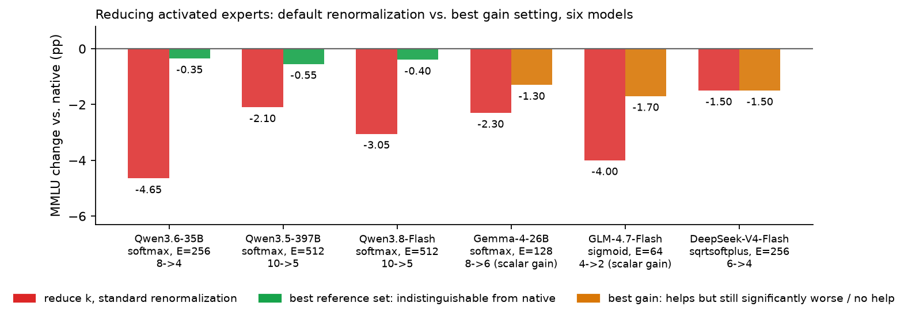
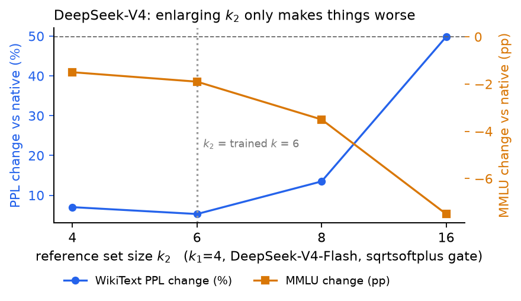

# Halving the Activated Experts of a MoE Without Training: The Integer Hiding Inside Renormalization

> Fine-grained Mixture-of-Experts models (hundreds of small experts, 8 picked per token) lose accuracy when you lower top-k at inference, and the usual remedy is retraining or distillation.
> We find that much of that loss is **not caused by having fewer experts, but by renormalization turning the "volume" of the expert branch to the wrong level**.
> Decoupling the renormalization denominator from "the k experts you picked" to "the top k₂ experts" is one integer, zero parameters, zero training and zero measurable compute,
> and it lets three Qwen MoE models (35B to 397B) halve their activated experts with MMLU and GSM8K statistically indistinguishable from native.
> It is **not universal**: on Gemma-4 it recovers only half the loss, and on GLM-4.7 and DeepSeek-V4 it does essentially nothing. The gating function decides.

This post is the consolidated write-up of every experiment in the `moe_breakdown` project. All numbers come from the raw result files under `stats/`; the figures are produced by `blog/make_blog_figs.py`.

---

## TL;DR

| | Default (lower k, renormalize as usual) | Decoupled denominator |
|---|---|---|
| Qwen3.6-35B-A3B, 8 → 4 experts | MMLU **−4.65 pp** (p = 1.7e-9) | **−0.35 pp** (p = 0.66, indistinguishable) |
| Qwen3.5-397B-A17B, 10 → 5 | **−2.10 pp** (p = 1e-4) | **−0.55 pp** (p = 0.24) |
| Qwen3.8-Flash-Next, 10 → 5 | **−3.05 pp** (p < 1e-5) | **−0.40 pp** (p = 0.55) |

On all three models, routed-expert compute is halved and MMLU is indistinguishable from the native model under a paired McNemar test. The same holds on GSM8K generation.

Four side findings:

1. **Removing renormalization entirely is catastrophic** (−27 to −44 pp). The model is not indifferent to weight magnitudes; it is sensitive to the gain being wrong.
2. **Which experts matters about 6× more than how much weight they get.** With 8 experts fixed, uniform weights cost +50% perplexity, sampling experts +310%, random experts +1667%.
3. **Perplexity picks the wrong operating point.** On the 35B model the perplexity-optimal k₂=8 is significantly worse on MMLU (−1.10 pp, p=0.021); MMLU prefers k₂=16.
4. **It does not cross gating families.** Softmax gating (the Qwen series) works; Gemma-4 partially; sigmoid / sqrtsoftplus gates with a fixed trained scale (GLM-4.7, DeepSeek-V4) do not.

---

## 1. The problem: a memory/compute asymmetry

Take Qwen3.6-35B-A3B: 40 layers, all MoE, 256 experts per layer, 8 selected per token. Measured parameter breakdown:

| Group | Params | Share |
|---|---|---|
| Routed experts | 32.21 B | **89.6%** |
| Attention + embeddings + shared expert + norms | 2.45 B | 6.8% |
| MTP head | 0.85 B | 2.4% |
| Vision tower | 0.45 B | 1.2% |

Each token touches 8 + 1 experts per layer, i.e. 3.1% of expert parameters. **All 256 experts must be resident, 8 are used**: a 32 : 1 memory-to-compute asymmetry.

This splits compression into two families that do not substitute for each other:

| Lever | Saves memory | Saves compute |
|---|---|---|
| Fewer experts (pruning / merging) | yes | no, still top-8 |
| Lower top-k | no | yes |
| Quantization | yes | no |

The memory side is heavily studied. The compute side is usually treated as trivial: k is an inference argument, so lower it, renormalize the survivors, report the loss. The loss is large, so the reported remedies are training-based (Matryoshka-style retraining with sampled k, distilling a student that skips half its experts, and so on).

We argue this treatment misses one detail, and that detail dominates the outcome.

---

## 2. What the router is actually doing

### 2.1 The distribution is very flat: top-8 holds 18% of the mass

We record every layer's router softmax with forward hooks over 500K tokens:



*Figure 1: Mean router softmax by rank (a) and cumulative mass (b) for three Qwen MoE models. The top-k selected in training carries only 15% to 19% of the total probability mass.*

| Model | E / k | Mass in trained top-k | Renormalization gain |
|---|---|---|---|
| Qwen3.6-35B-A3B | 256 / 8 | 0.18 | 5.5× |
| Qwen3.5-397B-A17B | 512 / 10 | 0.19 | 5.2× |
| Qwen3.8-Flash-Next | 512 / 10 | 0.15 | 6.6× |
| Gemma-4-26B-A4B (base) | 128 / 8 | 0.30 | 3.3× |

This is the physical background for everything that follows. The native renormalization `w = p / p[topk].sum()` multiplies the selected probabilities by more than 5×, and that factor was tied to k=8 during training. Change k without changing the denominator logic and the factor drifts.

### 2.2 Load is well balanced; there is no obvious fat to cut

| | WikiText | Code |
|---|---|---|
| Normalized entropy (1.0 = uniform) | 0.889 | 0.915 |
| Gini coefficient | 0.581 | 0.492 |
| Never-activated experts per layer (median / max) | 0 / 1 | 0 / 0 |



*Figure 2: Routing structure of Qwen3.6-35B-A3B. (a) Per-layer Jensen–Shannon divergence between WikiText and Code expert distributions rises with depth; full-attention layers marked separately. (b) Routing mass retained when keeping only the top-N experts per layer; bands span the best and worst layer. Keeping half the experts retains only 81% to 89% of the mass, and the worst layer 64%.*

### 2.3 Experts are strongly domain-specialized, which closes the door on general pruning

- Mean per-layer JS divergence between WikiText and Code is 0.258 nats, roughly 8,000× the within-domain resampling noise floor.
- The top-64 expert sets of the two domains overlap at **0.164, below the 0.250 random baseline**. The domains do not merely prefer different experts; they avoid each other's.
- Pruning to 128 experts using Code-derived rankings retains 81% of Code routing mass; using WikiText-derived rankings retains only 38% on the same domain.
- The union of the two domains' top-128 sets covers 198 of 256 experts.

Domain-specific pruned models are possible; a general-purpose pruned model has almost no room. This is the first reason we look at the compute side instead.

### 2.4 A side observation: in hybrid-attention models, layers are not interchangeable samples

Qwen3.6 interleaves linear-attention and full-attention layers 3 : 1. Grouping by type reveals that full-attention layers share expert preferences with each other (cross-layer top-64 overlap 0.309 vs 0.250 baseline), linear-attention layers are near-independent (0.258), and cross-type pairs are at chance (0.251). The shared-expert gate differs too (0.178 vs 0.151). A layer-agnostic routing analysis averages this structure away.

---

## 3. Expert selection matters far more than expert weighting

For a global gain correction to work, the model must be much more sensitive to *which* experts are chosen than to their exact weights. Three ablations, all with exactly 8 experts activated so compute is constant:



*Figure 3: Perplexity relative to native for four routing rules, 8 experts activated in every case (log axis).*

| Routing rule | Qwen3.6 WikiText | Qwen3.6 Code | Gemma-4 WikiText |
|---|---|---|---|
| top-k (native) | 6.64 | 2.59 | 9.16 |
| top-k, uniform 1/8 weights | +49.7% | +20.3% | +34.4% |
| 8 sampled without replacement | +310% | +135% | +218% |
| 8 uniformly random | +1667% | +623% | +2436% |

Two consequences:

- **Negative**: anything that injects randomness into selection (approximate top-k, LSH routers) is off the table for these models. Exact argmax is a hard requirement.
- **Positive**: the model tolerates large distortion of the weight magnitudes as long as the selected set is right. Lowering k produces a systematic, not random, magnitude error, so a single global correction should be enough.

---

## 4. The method: decouple the renormalization denominator

The native router (Qwen, and most modern MoEs):

$$
\begin{aligned}
p &= \operatorname{softmax}(W_g\, x) && \text{router scores over all } E \text{ experts} \\
T_k &= \operatorname{topk}(p,\, k) \\
w_i &= \frac{p_i}{\sum_{j \in T_k} p_j},\quad i \in T_k && \text{renormalize: weights sum to } 1 \\
y &= \sum_{i \in T_k} w_i\, \mathrm{Expert}_i(x) + g_{\mathrm{sh}}\, \mathrm{Expert}_{\mathrm{sh}}(x)
\end{aligned}
$$

The denominator $m_k(x) = \sum_{j \in T_k} p_j$ is the mass of the selected set, and it grows with k. Renormalization multiplies by $1/m_k$, a gain calibrated during training at k=8. Drop k to 4 and $m_4 < m_8$, so the gain **goes up**, pushing the expert branch's contribution to the residual stream into a regime the model never saw. "How much does top-4 lose" therefore conflates two effects: four fewer experts, and a miscalibrated gain.

We change only the index set of the denominator:

$$
w_i = \frac{p_i}{\sum_{j \in T_{k_2}} p_j}, \qquad i \in T_{k_1}, \quad k_1 \le k_2
$$

`k₁` controls compute (how many expert FFNs actually run), `k₂` controls gain. It strictly generalizes existing practice:

| Setting | Meaning |
|---|---|
| k₂ = k₁ | standard renormalization (every implementation's default) |
| k₂ = k (trained value) | gain anchored to what training calibrated |
| k₂ = E | no renormalization at all ($\sum p = 1$) |
| k₂ > k | gain below the trained value, **adaptive per token** |



*Figure 4: Using the mean routing profile of Qwen3.6-35B. Left: native top-8, gain 5.6×. Middle: the default reduction to top-4 shrinks the denominator too, gain rises to 8.3×. Right: activate 4 but normalize by the top-16 mass, gain falls to 3.8× and the weights sum to 0.47.*

When k₂ > k₁ the weights no longer sum to one but to $m_{k_1}(x)/m_{k_2}(x)$, a per-token scaling rather than a constant. On the 35B model the average is 0.854 for (k₁, k₂) = (6, 8) and 0.592 for (6, 16), so the discrete k₂ grid already covers the range a tuned continuous scalar would explore, without introducing a continuous hyperparameter.

**Cost**: only k₁ expert FFNs are evaluated, so the compute saving is exactly that of lowering k to k₁. The larger k₂ is just a wider top-k over router logits that are computed for all E experts anyway. Implementation is a drop-in replacement of the router's `forward` at inference time; no weights change:

```python
def patched_forward(self, hidden_states):
    hidden_states = hidden_states.reshape(-1, self.hidden_dim)
    router_logits = F.linear(hidden_states, self.weight)
    probs = F.softmax(router_logits, dtype=torch.float, dim=-1)
    k1, k2 = CFG["k1"], CFG["k2"]
    v, idx = torch.topk(probs, max(k1, k2), dim=-1)      # sorted; prefixes are the smaller top-k
    w = v[:, :k1] / v[:, :k2].sum(-1, keepdim=True)
    return router_logits, w.to(router_logits.dtype), idx[:, :k1]
```

---

## 5. Evaluation protocol

The effects are 0.3 to 5 percentage points. A sloppy protocol cannot see them.

- **Perplexity**: 100K-token samples of WikiText-103 and a Python subset of CodeParrot at 2048 context, plus a held-out WikiText split (beyond row 400,000, disjoint from the tuning split) to check that the choice of k₂ does not overfit. All configurations are scored on byte-identical token chunks.
- **MMLU**: 2000 questions sampled with a fixed seed from all 14,042 across 57 subjects, 5-shot, scored by comparing the logits of the single tokens A–D.
- **C-Eval**: 1300 questions, 5-shot, Chinese.
- **GSM8K**: 500 questions, 0-shot, greedy decoding, thinking disabled via the chat template, exact match on the final number, truncation rate recorded.
- **Paired McNemar test**: every configuration runs the identical question set. At n=2000 the paired design resolves 0.98% differences; unpaired needs 3.04%. **Without pairing, most effects in this post are invisible.** Each row also reports the absolute counts of "baseline right, variant wrong" and the reverse; equivalent models should be roughly symmetric.

---

## 6. Results on the Qwen series

### 6.1 Perplexity: both endpoints are wrong, the optimum is interior

| Configuration | WikiText | Held-out | Code |
|---|---|---|---|
| **Qwen3.6-35B-A3B** (k=8, E=256) | | | |
| k₁=8 native | 6.643 | 6.986 | 2.585 |
| k₁=6, k₂=6 (default) | +4.08% | +4.69% | +1.72% |
| **k₁=6, k₂=8** | **−1.61%** | **−0.57%** | **+0.68%** |
| k₁=6, k₂=16 | +1.81% | +1.42% | +3.29% |
| k₁=6, k₂=32 | +23.3% | +19.0% | +13.0% |
| k₁=6, k₂=256 (no renorm.) | +356% | +313% | +158% |
| **Qwen3.5-397B-A17B** (k=10, E=512) | | | |
| k₁=10 native | 4.159 | 3.198 | 2.249 |
| k₁=8, k₂=8 (default) | +1.06% | +1.54% | +0.42% |
| **k₁=8, k₂=10** | **+0.46%** | **+0.56%** | **+0.34%** |
| k₁=8, k₂=20 | +4.98% | +4.95% | +2.18% |
| k₁=8, k₂=512 | +128% | +146% | +56% |
| **Qwen3.8-Flash-Next** (k=10, E=512) | | | |
| k₁=10 native | 5.145 | 4.761 | — |
| k₁=8, k₂=8 (default) | +4.35% | +3.74% | — |
| k₁=8, k₂=10 | +0.96% | +0.22% | — |
| **k₁=8, k₂=20** | **+0.13%** | **−0.93%** | — |
| k₁=8, k₂=40 | +9.54% | +8.49% | — |
| k₁=8, k₂=512 | +424% | +436% | — |

Three observations:

- **No renormalization is a disaster** (+128% to +436%). The model depends on the amplification rather than tolerating it.
- **Shrinking the denominator with k₁ (the default) is never the best setting.** On all three models and six corpora the perplexity optimum sits at k₂ ≥ trained k, and it is an interior grid point, not an endpoint.
- On the 35B model, k₁=6/k₂=8 **beats** native top-8 perplexity and the held-out split reproduces it, ruling out overfitting. Flash-Next at k₂=20 also beats native on held-out.

### 6.2 MMLU: halving activated experts is indistinguishable from native



*Figure 5: MMLU change versus k₂/k for three Qwen models at two values of k₁ each. The leftmost point of each curve is standard renormalization (k₂=k₁). Hollow markers are significantly worse under a paired McNemar test (p<0.05); filled markers are indistinguishable. The k₂=E endpoint is off-scale and omitted.*

| Configuration | Acc. | Δ (pp) | flips −/+ | McNemar p |
|---|---|---|---|---|
| **Qwen3.6-35B-A3B**, n=2000 | | | | |
| k₁=8 native | 81.65% | — | — | — |
| k₁=6, k₂=6 | 79.05% | −2.60 | 82 / 30 | 9.3e-7 |
| k₁=6, k₂=8 | 80.55% | −1.10 | 53 / 31 | 0.021 |
| **k₁=6, k₂=16** | **82.40%** | **+0.75** | 74 / 89 | **0.27** |
| k₁=6, k₂=256 | 54.20% | −27.45 | 637 / 88 | 1e-103 |
| k₁=4, k₂=4 | 77.00% | −4.65 | 166 / 73 | 1.7e-9 |
| k₁=4, k₂=8 | 78.55% | −3.10 | 97 / 35 | 6.4e-8 |
| **k₁=4, k₂=16** | **81.30%** | **−0.35** | 99 / 92 | **0.66** |
| **Qwen3.5-397B-A17B**, n=2000 | | | | |
| k₁=10 native | 89.45% | — | — | — |
| k₁=8, k₂=8 | 89.60% | +0.15 | 23 / 26 | 0.78 |
| k₁=8, k₂=10 | 89.00% | −0.45 | 28 / 19 | 0.24 |
| k₁=5, k₂=5 | 87.35% | −2.10 | 78 / 36 | 1.0e-4 |
| **k₁=5, k₂=10** | **88.90%** | **−0.55** | 42 / 31 | **0.24** |
| k₁=5, k₂=20 | 87.75% | −1.70 | 64 / 30 | 5.9e-4 |
| k₁=5, k₂=512 | 70.90% | −18.55 | 410 / 39 | 1e-79 |
| **Qwen3.8-Flash-Next**, n=2000 | | | | |
| k₁=10 native | 87.05% | — | — | — |
| k₁=8, k₂=8 | 86.70% | −0.35 | 50 / 43 | 0.53 |
| **k₁=8, k₂=10** | **87.15%** | **+0.10** | 36 / 38 | **0.91** |
| k₁=5, k₂=5 | 84.00% | −3.05 | 115 / 54 | <1e-5 |
| **k₁=5, k₂=10** | **86.65%** | **−0.40** | 74 / 66 | **0.55** |
| k₁=5, k₂=20 | 85.40% | −1.65 | 102 / 69 | 0.014 |
| k₁=5, k₂=512 | 43.10% | −43.95 | 961 / 82 | ~0 |

Key points:

- **Halving is free, if the denominator is not halved too.** On the 35B model, 4 of 8 experts costs 4.65 pp by default and 0.35 pp at k₂=16, with a near-symmetric flip distribution (99/92). The 397B and Flash-Next models recover 1.55 and 2.65 pp respectively.
- **The optimal k₂ is model-dependent and lies in [k, 2k].** The 35B model prefers 2k; the 397B and Flash-Next models prefer k. We do not propose a universal value; we propose scanning {k₁, k, 2k}. The one finding consistent across models is the negative one: k₂=k₁, every implementation's default, is the worst choice in that grid once the cut is deep.
- **The ablation structure decides what you conclude.** Had we evaluated only baseline and final candidate, the 35B result would read "top-4 is simply lossless" and credit nothing to the denominator; only the k₂=k₁ row shows the reduction is damaging by default. Conversely, the 397B k₁=8 block is already fine at the default (+0.15); reporting only that row would conclude renormalization never matters.
- **Not significant is not proof of equivalence.** The paired design only bounds any residual loss below the 0.98 pp resolution at n=2000.

### 6.3 Perplexity picks a significantly worse operating point



*Figure 6: Qwen3.6-35B, k₁=6. WikiText perplexity (blue, left axis) and MMLU (orange, right axis) versus k₂. Stars mark each metric's optimum.*

Perplexity is minimized at k₂=8, MMLU at k₂=16. The perplexity-optimal setting is significantly worse on MMLU (−1.10 pp, p=0.021), and the MMLU-optimal one is 1.81% worse on perplexity. The two metrics do not merely differ in sensitivity; they are **optimized at different points**, so perplexity mis-ranks configurations.

Since selecting k₂ on unlabeled text is exactly the cheap protocol one would reach for, we regard this as the main methodological finding: **compression settings chosen on perplexity alone should be treated as unvalidated.** Flash-Next reproduces it (perplexity optimum k₂=20, MMLU optimum k₂=10).

### 6.4 GSM8K: the effect survives autoregressive decoding, and is sharper

A single-token multiple-choice score cannot reveal damage that accumulates over a generated sequence, so we repeat on GSM8K:



*Figure 7: GSM8K, 500 questions, greedy decoding. (a) Accuracy. (b) Fraction of generations that hit the token budget without an answer. Flash-Next uses a 1024-token budget, the others 512.*

| Configuration | Acc. | Δ (pp) | McNemar p | trunc. |
|---|---|---|---|---|
| **Qwen3.6-35B**, n=500 | | | | |
| k₁=8 native | 95.0% | — | — | 2.8% |
| k₁=6, k₂=6 | 92.8% | −2.20 | 0.027 | 6.0% |
| k₁=6, k₂=8 | 95.0% | 0.00 | 1.00 | 2.2% |
| k₁=4, k₂=4 | 88.4% | −6.60 | 1e-6 | 10.4% |
| **k₁=4, k₂=16** | **94.4%** | **−0.60** | **0.68** | 1.4% |
| **Qwen3.5-397B**, n=500 | | | | |
| k₁=10 native | 96.6% | — | — | 2.6% |
| k₁=8, k₂=8 | 94.6% | −2.00 | 0.006 | 3.8% |
| k₁=8, k₂=10 | 96.2% | −0.40 | 0.63 | 2.2% |
| k₁=5, k₂=5 | 92.4% | −4.20 | 1e-5 | 7.0% |
| **k₁=5, k₂=10** | **95.8%** | **−0.80** | **0.34** | 1.6% |
| **Qwen3.8-Flash-Next**, n=500, 1024-token budget | | | | |
| k₁=10 native | 96.6% | — | — | 0.8% |
| k₁=5, k₂=5 | 95.6% | −1.00 | 0.13 | 2.0% |
| **k₁=5, k₂=10** | **96.2%** | **−0.40** | **0.80** | 2.2% |

The default halving costs 6.60 and 4.20 pp on the 35B and 397B models, more than on MMLU, as expected if a miscalibrated gain compounds token by token. With the denominator anchored the loss is undetectable. Truncation tracks the accuracy loss: the default reduction does not merely change answers, it **wanders and fails to finish**.

### 6.5 C-Eval: a benchmark's sensitivity is not a property of the benchmark

| Configuration | Qwen3.6-35B (baseline 83.92%) | Qwen3.5-397B (baseline 88.31%) |
|---|---|---|
| k lowered to 0.75k / 0.8k, k₂=k₁ | +0.23 (p=0.80) | **−2.92 (p<1e-4)** |
| k lowered to 0.75k / 0.8k, k₂=k | +0.62 (p=0.31) | −1.00 (p=0.015) |
| k lowered to 0.5k, k₂=k | −0.77 (p=0.31) | −0.77 (p=0.20) |

On the 35B model C-Eval is insensitive to **every** configuration; read alone it would license the default reduction that MMLU and GSM8K reject. The same benchmark on the 397B model rejects the default. The recovery direction is consistent with every other result (anchoring helps, k₂=k₁ is worst), but validating on a single (benchmark, model) pair risks certifying an artifact of that pair. This is the perplexity caution one level up.

### 6.6 Cost accounting

On the 35B model, lowering k₁ from 8 to 4 halves routed-expert activated parameters (1.006 B to 0.503 B) and cuts the total expert term including the shared expert by 44% (1.132 B to 0.629 B), a 17% end-to-end reduction against about 3.0 B activated parameters per token. During memory-bound decoding the expert weights dominate traffic. Memory is unchanged since all experts stay resident, so this is a pure compute-side lever, orthogonal to quantization.

---

## 7. Across architectures: three models where it fails or half-works



*Figure 8: MMLU change for "lower k with standard renormalization" versus "best gain setting" on six models. Green = indistinguishable from native; orange = helps but still significantly worse, or no help. Gemma, GLM and DeepSeek use n=1000; Gemma and GLM use the earlier scalar-gain parameterization (α or s), so their numbers are not directly comparable to the Qwen k₁/k₂ results.*

| | Qwen3.6 | Qwen3.5 | Qwen3.8-Flash | Gemma-4 | GLM-4.7 | DeepSeek-V4 |
|---|---|---|---|---|---|---|
| E / k | 256 / 8 | 512 / 10 | 512 / 10 | 128 / 8 | 64 / 4 | 256 / 6 |
| Gate score | softmax | softmax | softmax | softmax (learned temperature) | sigmoid + selection bias | sqrtsoftplus + selection bias |
| Fixed scale after renorm. | none (implicit 1.0) | none | none | per-expert scale, learned ≈1.0 | hand-set 1.8 | hand-set 1.5 |
| Mass in trained top-k | 0.18 | 0.19 | 0.15 | 0.30 | — | — |
| Tuning the gain helps | yes | yes | yes | yes (+1.0 pp) | yes (+2.3 pp) | **no** |
| 20–25% fewer experts, lossless | yes | yes | yes | no (−1.30, p=0.079 borderline) | no (−1.50, significant) | yes (6→5, already free by default) |
| Half the experts, lossless | yes | yes | yes | not tested | no | no (−1.50, significant) |

### 7.1 Gemma-4-26B-A4B: half the way

This branch ran before the k₁/k₂ parameterization, with a global scalar gain $w = \alpha \cdot p / m_{k_1}$, MMLU n=1000, instruction-tuned variant under its chat template (baseline 80.40%):

| α | Acc. | Δ (pp) | p |
|---|---|---|---|
| 1.00 (native renormalization) | 78.10% | −2.30 | 0.0018 |
| 0.90 | 78.60% | −1.80 | 0.015 |
| 0.85 (the "natural" ratio m₆/m₈) | 78.60% | −1.80 | 0.020 |
| **0.80** | **79.10%** | **−1.30** | **0.079** |
| 0.75 | 78.80% | −1.60 | 0.033 |

The gain helps (1.0 pp recovered, the only non-significant setting) but does not return to baseline. This matches the mechanism: Gemma's top-8 mass is 0.30, so the renormalization gain is 3.3× rather than 5.5× and is simply less load-bearing. On the base variant, removing renormalization entirely (k₂=E) costs only +0.7% perplexity and is actually better than standard renormalization at k₁=6, whereas the identical intervention costs +356% on Qwen.

Gemma also supplies an interesting piece of side evidence. Its router has two learnable scale parameters. The pre-softmax temperature `router.scale` was trained hard, from 1.0 to 32.06 ± 0.02, near-constant across all 30 layers. The post-selection amplitude `per_expert_scale` stayed at initialization: all 3840 values are 1.000 ± 0.011, because it is mathematically redundant with each expert's `down_proj` and the gradient flows to the much larger weights instead. **The amplitude degree of freedom was never optimized by training on any model we examined**: Qwen has no such parameter, Gemma has one but left it alone, GLM and DeepSeek set it by hand. We are not correcting an already-optimized quantity; we are filling a gap training leaves open.

### 7.2 GLM-4.7-Flash: the worst perplexity illusion of the project

64 experts / top-4, sigmoid scoring, and the config ships `routed_scaling_factor = 1.8`, i.e. Zhipu made the post-renormalization scale an explicit parameter. This branch scanned a scalar s; MMLU n=1000 to 2000.

The perplexity scan at one point showed **top-2 with the best s beating native top-4** (WikiText −4.50%, Code −3.07%). On MMLU (n=2000, baseline 72.00%):

| Configuration | Δ (pp) | flips −/+ | p |
|---|---|---|---|
| top-2, s=1.80 (default) | −5.40 | 225 / 117 | ~0 |
| top-2, s=1.60 (perplexity optimum) | −3.65 | 165 / 92 | ~0 |
| top-3, s=1.80 | −1.50 | 111 / 81 | 0.036 |

Scanning s from 1.2 to 2.0 at n=1000 (top-2, baseline 70.60%): the default s=1.8 sits at −4.0 pp, the best settings s=1.4 / 1.7 reach only −1.70 pp, no setting returns to baseline, and overshooting (1.9 / 2.0) drops to −7.7 / −9.6. Tuning the gain pays, but "halve the experts" does not hold on GLM. The n=1000 curve is non-monotone and sits at the resolution limit, so "the optimum is 1.4 or 1.7" is not trustworthy.

### 7.3 DeepSeek-V4-Flash: the denominator lever backfires

256 experts / top-6, `sqrt(softplus(x))` scoring, `e_score_correction_bias` used for selection only, weights normalized within the top-k and multiplied by a fixed 1.5. This is the GLM family of gating.



*Figure 9: DeepSeek-V4-Flash, k₁=4. WikiText perplexity change (blue) and MMLU change (orange, n=1000) versus k₂. Both degrade monotonically as k₂ grows.*

| k₁=4 | WikiText PPL | Held-out PPL | MMLU Δ (pp, n=1000) | p |
|---|---|---|---|---|
| k₂=4 (default) | +7.01% | +9.03% | **−1.50** | 0.032 |
| k₂=6 (= trained k) | **+5.28%** | **+5.09%** | −1.90 | 0.004 |
| k₂=8 | +13.5% | +13.1% | −3.50 | 1e-4 |
| k₂=16 | +49.8% | +59.3% | −7.50 | 1e-8 |
| k₂=256 | +1824% | +2206% | — | — |

No k₂ reaches the baseline, and MMLU degrades monotonically as k₂ grows. A mild reduction is free: at k₁=5 (17% fewer experts) the default k₂=k₁=5 is indistinguishable on MMLU (n=2000, −0.40, p=0.36), C-Eval (+0.15, p=0.85) and GSM8K (−0.20, p=1.0). But that is what the default already achieves; the denominator contributes nothing.

**Mechanism**: Qwen's softmax gate spreads mass flatly, top-k renormalization over-amplifies, and enlarging k₂ cancels the over-amplification. DeepSeek-V4's sqrtsoftplus scores experts independently, normalizes within the top-6 and multiplies by 1.5, and **that ×1.5 operating point was trained**. Lowering k₁ removes real routing capacity, and any k₂ > k₁ pushes the activated weights below the trained operating point. We also tried a variant that scales the magnitude back up by k₂/k₁, and a variant that replaces DeepSeek's normalization with a softmax; neither helped.

**One sentence**: the method works on softmax gates with an implicit renormalization gain, and fails on sigmoid / sqrtsoftplus gates with a trained fixed scale. The gating function decides, not model size or expert count. An earlier "expert-count hypothesis" (enough surviving votes makes reduction viable) was refuted by Gemma: it keeps 6 votes after a 25% cut, exactly like Qwen3.6, and still does not recover.

---

## 8. Composing with quantization

Lowering k saves compute only; quantization saves memory only; they are orthogonal. On Qwen3.6-35B we used a home-grown per-expert NF4 / INT8 slicing quantizer, because the stock bitsandbytes integration only sees `nn.Linear` while 91.8% of this model's parameters live in 3D fused-expert `nn.Parameter` tensors, so a naive `load_in_4bit` quantizes the wrong 6.7% of the model:

| Configuration | Memory | MMLU (n=1000) | Δ |
|---|---|---|---|
| bf16 top-8 | 65.4 GiB | 81.6% | — |
| INT8 top-8 | 37.3 GiB (−43%) | 81.8% | +0.2 (p=0.80) |
| NF4 top-8 | 22.3 GiB (−66%) | 81.4% | −0.2 (p=0.85) |
| NF4 + top-6 reduction (earlier scalar-gain version) | 22.3 GiB | 81.0% | −0.6 (p=0.49) |

Quantization barely perturbs the selected expert set: ranks 1–6 agree with bf16 at ≥ 96.6%, and the disagreement concentrates in ranks 7 and 8 (89.5% and 73.7% under NF4). This corroborates Section 3: quantization leaves the selection alone and only touches weight precision, the dimension the model cares least about; and ranks 7 and 8 are already marginal, which is also why top-6 is viable.

The price: the current implementation dequantizes on the fly without a fused 4-bit grouped GEMM kernel, so prefill throughput drops 83% and decode 61%. That is the cost of a naive implementation, not of quantization itself, but it is real in this environment.

---

## 9. Methodological lessons

Every one of these changed a conclusion at some point.

1. **Pair the comparison and report the flip counts.** Unpaired testing at n=2000 cannot resolve differences under 3%; the effects here are 0.3 to 5%. Flip distributions of 84/29 and 44/37 tell completely different stories.
2. **Always include the k₂=k₁ control.** Without it the credit goes to the wrong place ("lowering k was lossless anyway") or the denominator's role is invisible.
3. **Perplexity-optimal is not downstream-optimal, and they can be systematically opposed.** Perplexity alone cannot set an operating point. On GLM perplexity said "better than native" while MMLU said "−3.65 pp, highly significant".
4. **A single (benchmark, model) pair cannot certify a configuration.** C-Eval on the 35B model is insensitive to everything.
5. **Validate the protocol on a small sample before the full run.** The first MMLU protocol (0-shot, per-option log-likelihood) scored the 35B model at 53%; standard 5-shot single-letter scoring restored 81.65%. An implausibly low absolute score is a protocol problem, not a model problem.
6. **Match the protocol to the model's form.** Gemma is a reasoning model with a thought channel: the instruction-tuned variant scores WikiText perplexity 573 under bare completion, the base variant 9.6. We misattributed this three times in a row (missing BOS, attention implementation, framework version) and upgraded transformers from 5.3 to 5.14 before finding the real cause. A good sanity signal is whether the prediction distribution is balanced: GLM under a chat template scores 44% on 5-shot MMLU and almost never predicts C.
7. **Verify the generation budget before trusting a generation benchmark.** The first Flash-Next GSM8K run used 512 tokens and concluded "k₁=5 degrades significantly and k₂ does not recover it". The 99th percentile of untruncated answers was 701 tokens. At 1024 the conclusion flipped entirely (−3.20 pp became −0.40 pp, p=0.80). Report the length distribution; if p99 approaches the budget, the numbers are not trustworthy.
8. **An optimum on the edge of a scan is not a result.** Extend and rescan.
9. **Class-level patches silently fail under multi-GPU `device_map`.** accelerate shadows the class forward with an instance attribute, so `Router.forward = patched` is hit zero times and every scan equals the baseline. We caught it because "k₁=2 has the same loss as baseline" was impossible. Every model adapter now runs a patch-equivalence and call-path self-check.
10. **Models think spontaneously, and generation configs default to sampling.** Disable thinking explicitly via the chat template and set `do_sample=False` explicitly.

---

## 10. Limitations and conclusion

**Limitations.** The three positive results all come from the Qwen series, although they span 11× in parameters and differ in depth, expert count and k. The Gemma and GLM data use the earlier scalar parameterization and smaller n and are not directly comparable to the Qwen numbers. Corpora are English and Python only; long context is untested. Downstream coverage is multiple choice and short-form generation, not long-form generation. k₂ was scanned on a geometric grid; a per-layer or per-domain k₂ may do better.

**Conclusion.** The "cost of lowering k" in a fine-grained MoE is confounded by a hidden variable. Renormalization applies a gain calibrated at the trained k; when k is lowered the denominator shrinks with it and the expert branch is silently turned to the wrong volume. Decoupling "activate k₁ experts" from "normalize by the top-k₂ mass" is one integer, no training and no measurable compute, and on softmax-gated Qwen models it halves activated experts with no detectable loss. It does not transfer to other gating families, and perplexity cannot be used to select it, so the knob should be validated on a downstream task with paired testing.

For practitioners: when compute or decode bandwidth binds, decouple the denominator whenever you change k, scan k₂ ∈ {k₁, k, 2k}, and test paired. Three evaluations and one integer separate a significant 2 to 5 point regression from none. It is also the control that any published top-k reduction result should include: without a decoupled k₂, those numbers overstate the cost of lowering k.
